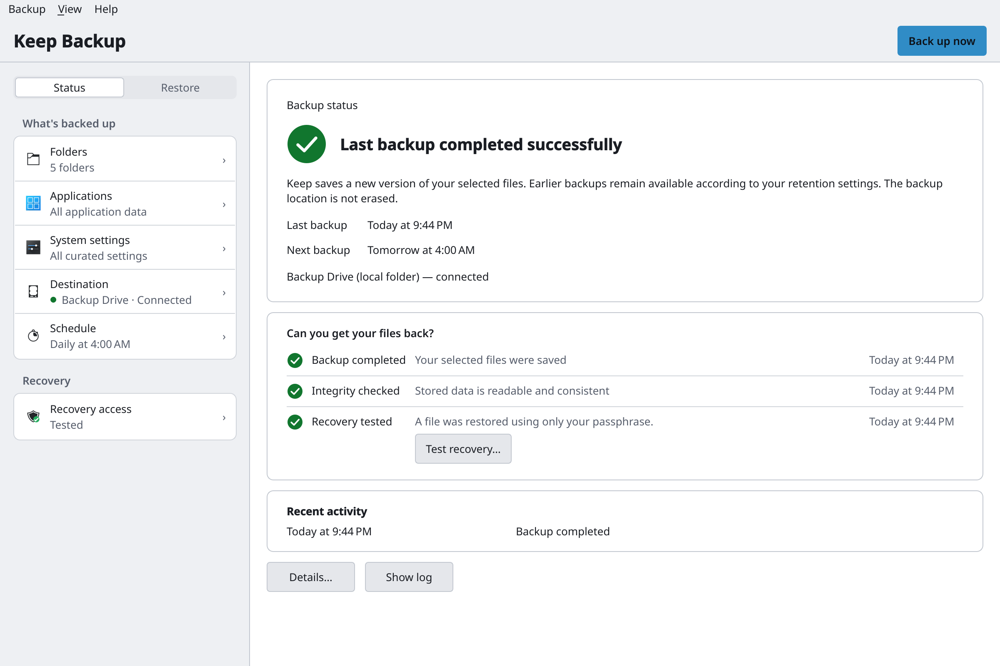
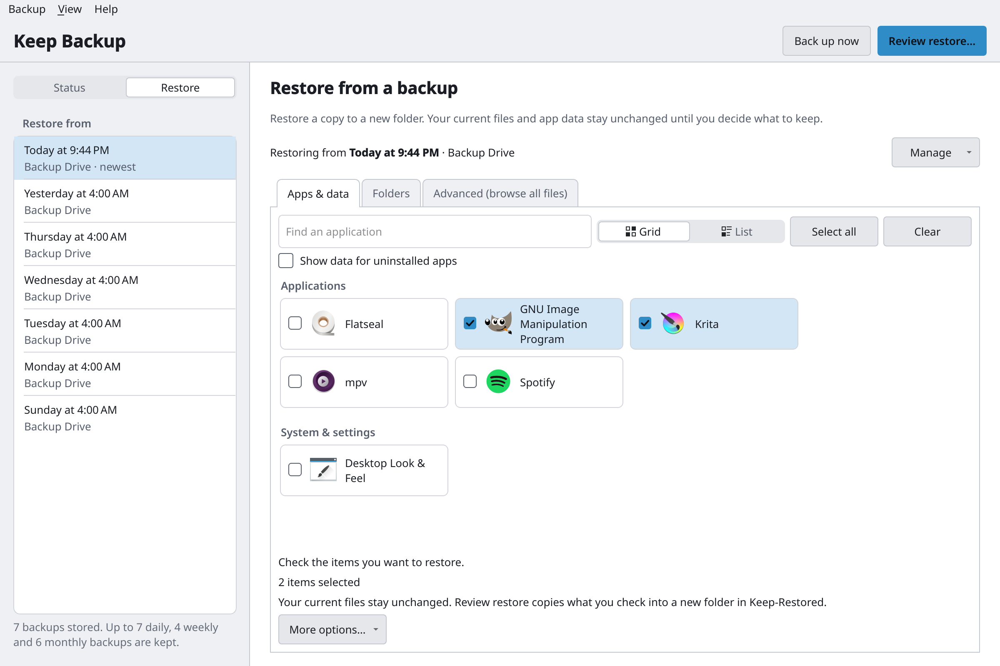
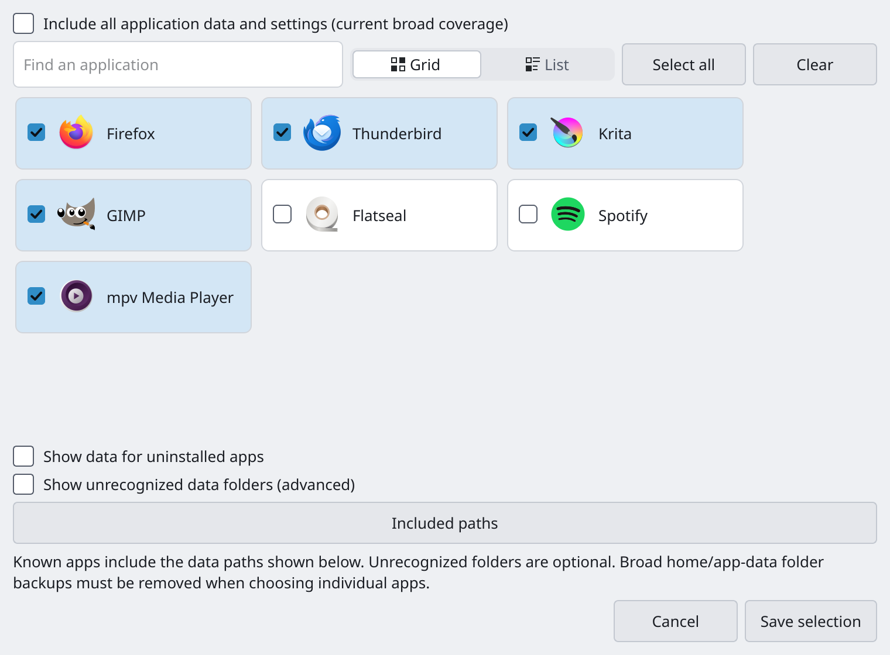
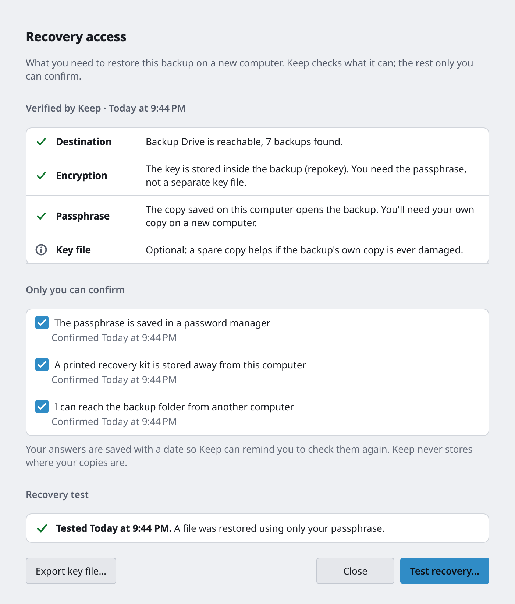
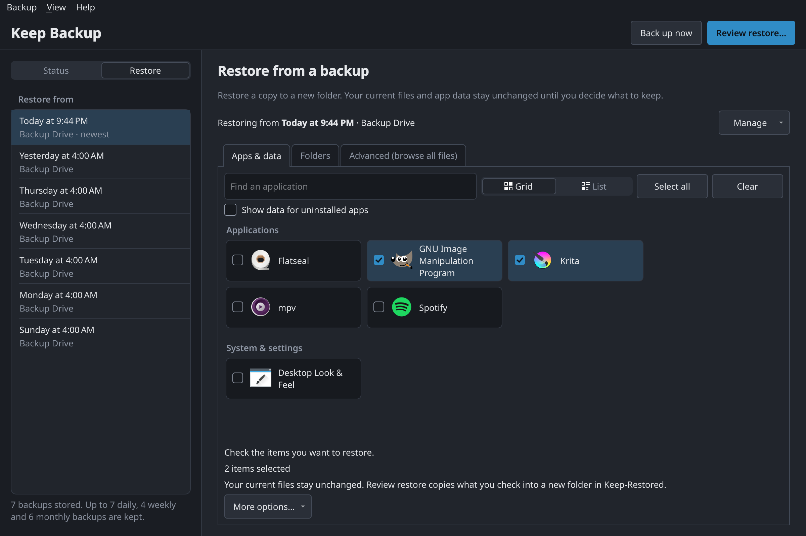

<div align="center">


# Keep Backup

**Backups you can prove you can restore.**<br>
A desktop backup app for Linux, built on [BorgBackup](https://www.borgbackup.org/).

[](https://github.com/tneohcl/keep/actions/workflows/linux.yml)
[](LICENSE)


</div>

<picture>
  <source media="(prefers-color-scheme: dark)" srcset="docs/screenshots/status-dark.png">
  
</picture>

Most backup tools tell you a backup *ran*. Keep Backup also tells you whether you could
*get your files back*: it checks the stored data, restores a sample file using only your
passphrase, and keeps a checklist of what you would need on a new computer.

## Features

- **Choose what matters.** Your folders, plus the data and settings of the apps you use.
  Native and Flatpak apps are detected for you, and curated desktop settings can be included too.
- **Back up to a NAS, a USB drive or any folder.** A removable drive is recognised by its
  filesystem ID, not its mount path, and a backup never silently writes somewhere else when
  the destination is missing.
- **Encrypted, deduplicated, compressed.** Backups are standard Borg repositories. Encryption
  is the recommended default, and after the first run only changed data is stored.
- **Automatic.** Daily or weekly on a per-user systemd timer, so backups run with the app closed.
  Older versions thin out automatically (7 daily, 4 weekly and 6 monthly by default).
- **Proof, not hope.** The Status view answers *Can you get your files back?* with the last
  backup, the latest integrity check and a recovery test that restores a random file with only
  your passphrase and verifies its checksum.
- **Recovery access.** A checklist of what a new computer needs, a key-file export, and a
  guided unlock with your passphrase, a key file or a printed paper key.
- **Restore without risk.** *Review restore* copies what you pick into a new folder and never
  touches live files. *Restore to original location* confirms first and saves what it replaces.
  Browse every file, or compare two backups.
- **Problems in plain language.** "The backup destination is full" or "The backup destination
  disconnected during the backup", not an exit code, with the full log one click away.
- **No lock-in.** Everything Keep Backup writes can be restored with the `borg` command alone:
  see [DISASTER_RECOVERY.md](DISASTER_RECOVERY.md).

## Screenshots

<table>
  <tr>
    <td width="50%"></td>
    <td width="50%"></td>
  </tr>
  <tr>
    <td align="center"><sub>Pick a backup, then the apps, folders or files to bring back</sub></td>
    <td align="center"><sub>Choose apps one by one, or include all application data</sub></td>
  </tr>
  <tr>
    <td width="50%"></td>
    <td width="50%"></td>
  </tr>
  <tr>
    <td align="center"><sub>Recovery access: what a new computer would need</sub></td>
    <td align="center"><sub>Follows your light or dark desktop theme</sub></td>
  </tr>
</table>

## Install

Keep Backup is pre-1.0 and runs on Linux. A Flathub release is planned; until then, build it
from this repository.

### Flatpak (recommended)

Needs `flatpak` and the Flathub remote.

```sh
git clone https://github.com/tneohcl/keep.git && cd keep
flatpak install --user flathub org.flatpak.Builder
flatpak run org.flatpak.Builder --user --install --force-clean \
    --install-deps-from=flathub build-flatpak packaging/flatpak/io.github.tneohcl.Keep.yml
flatpak run io.github.tneohcl.Keep
```

Borg and FUSE (for browsing backups) are bundled. Why the app needs broad file access is
explained in [packaging/flatpak/README.md](packaging/flatpak/README.md).

### Debian and Ubuntu package

```sh
packaging/build-deb.sh            # writes dist/keep-backup_<version>_all.deb
sudo apt install ./dist/keep-backup_*_all.deb
```

Installs `keep` (the app) and `keep-cli`, using the distribution's Python, PySide6 and Borg.

### From source

Needs Python 3.10 or newer and BorgBackup 1.2 or newer (1.x).

```sh
./launch.sh
```

If PySide6 isn't installed, `launch.sh` creates a private `.venv` beside the app and installs
it there; the system Python is left alone.

## Getting started

1. **Choose a destination.** Pick a network share, a drive or a folder. For a new backup,
   keep encryption on and store the passphrase in your password manager: without it,
   nobody can open the backup, including you.
2. **Choose what to back up.** Your usual folders are suggested; add others, and choose which
   application data and settings to include.
3. **Turn on automatic backups**, or use **Back up now**.
4. **Prove it works.** Run **Test recovery** once the first backup is done, and go through
   **Recovery access** so you know what a new computer would need.

## How it works

Keep Backup is a front end to BorgBackup. Each run creates an archive named
`keep-<computer>-<date>` in your repository, then prunes older archives under that prefix
only, so other archives in an adopted repository are left alone. Settings live in
`~/.config/keep/config.json`, and each run writes a log to `~/.local/state/borg-logs`.
Passphrases and keys are never logged, and neither is the list of files backed up.

The same engine is available from the command line:

```sh
keep-cli status          # the schedule, its timer and next run
keep-cli archives        # this computer's backups
keep-cli check [--deep]  # verify the repository; --deep also reads all stored data
keep-cli doctor          # check the destination, Borg and the timer setup
```

## Documentation

| | |
|---|---|
| [Detailed guide](docs/GUIDE.md) | Configuration, destinations, restore and unlocking in depth |
| [Disaster recovery](DISASTER_RECOVERY.md) | Restore on a new computer with only Borg |
| [Command line](CLI.md) | `keep-cli` reference |
| [Architecture](ARCHITECTURE.md) | Modules, extension rules, validation |
| [Release readiness](RELEASE_READINESS.md) | Validation evidence and open gates |

## Development

```sh
packaging/test-linux.sh                  # unit, GUI smoke and recovery tests
packaging/acceptance.sh <python>         # failure scenarios: drive missing, removed or full, crashes
packaging/screenshots.sh <python>        # regenerate docs/screenshots from a demo user
```

The acceptance and screenshot scripts run in an unprivileged user and mount namespace with a
throwaway home folder, so your own backups and settings are never touched. The interface is
built with [odcs-ui](https://github.com/tneohcl/odcs-ui), bundled in `vendor/`
(update it with `packaging/sync-odcs-ui.sh <tag>`). Changes go through pull requests with a
required review and CI.

## License

MIT, see [LICENSE](LICENSE). Keep Backup is made by ODCS App Studio. It is built on
[BorgBackup](https://www.borgbackup.org/), and its Flatpak's Borg and FUSE modules are adapted
from [Vorta](https://github.com/borgbase/vorta)'s Flathub packaging.
